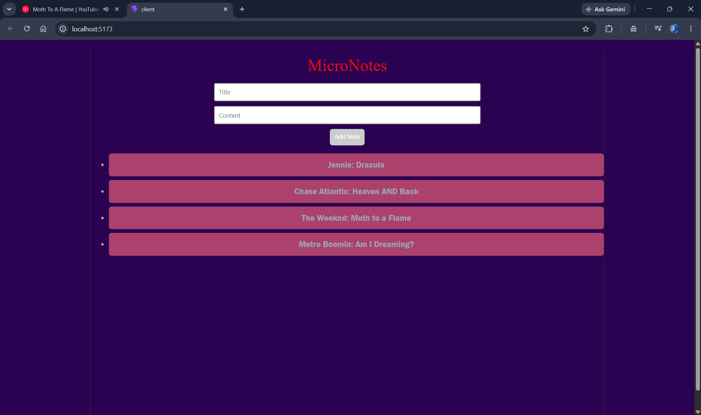

<b> <h2> >Here are the Steps how to start this project/app of Micronotes. </b></h2>

<h3>To run the frontend-> Go to the Project directory that is named 'Client' using these steps-</h3> 
1- cd client 
2- npm run dev (type this command to run the frontend server made using React) 
3- once the dev server is started, follow the default URL http://localhost:5173/ to see the Micronotes app. 

<h3>To start the backend-> Go to the server folder using these steps-</h3> 
1- cd .. (to go back to root directory) 
2- cd server 
3- node server.js (type this command to run the backend server made using Node.js) 
4- once the server is ON, you can see a message printing on the terminal like Server running on port 5000 which means the backend server is running fine. 

<b> <h2>>What does this app do?</b></h2> 
So, basically this is a Mirconotes app made using Node.js, React and Express.js. 
Using this app, you can add your little notes with a Title and a Content and it will show inforamtion of it in the app in realtime. 
We used api(s) to fetch the notes from backend(basically stored in a temp array as Sir gave it in the assignment, which resets after the server restarts). 
 

<b> <h2>>Screenshot of the APP working.</b></h2>

 

<b> <h3>>My thoughts over this app/assignment---</b></h3> 
In this assignment, we are studying about the basics of "ERN" stack, by creating a basic Mirconotes app using React.js and Node.js 
I made this app all by myself, there is no AI involved in it, the structure and code may look like AI generated but it's not. 
Yes, my English and puctuation might be good, hehe.. 
Also ik i did a super bad job at the color scheme of the App sorryy for that :D 

This assignment is submitted by Aryan Pratap Singh. 
Must have line so others might fail to copy my work ^_^
